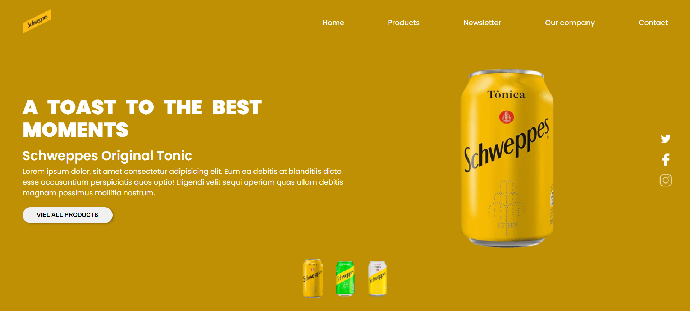

# Schweppes Themed Landing Page

This project is a responsive landing page inspired by the Schweppes brand, featuring a theme-switching functionality. Users can change between different color schemes, providing a personalized and dynamic experience. The page highlights Schweppes' elegant branding, with vibrant visuals and clean design.



## Installation

To view this landing page locally:

1. Clone the repository to your local machine:
   ```bash
   git clone https://github.com/belacartaxo/landing-page-schweppes.git
2. Navigate to the project directory:
    ```bash
    cd landing-page-schweppes
3. Open the index.html file in your preferred web browser.

## Usage
Simply open the index.html file in your web browser to view the page. You can change the themes by clicking on the different drink packaging at the bottom of the page

## Features
- Responsive Design: The layout adjusts to various screen sizes, ensuring a smooth experience on mobile, tablet, and desktop devices.
- Theme Switcher: Users can switch between different color themes (e.g., classic Schweppes gold, dark mode, and light mode) with a simple toggle or button.
- Schweppes Branding: The design uses Schweppes' signature color palettes and elegant visuals.
- Smooth Transitions: The theme changes are accompanied by smooth transitions, offering a visually appealing experience.

## Code Overview
- HTML: The structure of the landing page, including placeholders for the images, theme switcher, and content.
- CSS: Provides multiple color themes for the landing page. The themes are dynamically applied based on user interaction with the theme switcher.
- JavaScript: Handles the theme-switching functionality by dynamically changing the CSS classes or variables to apply the desired theme.


## Author
This repository is maintained by Your [Isabela Cartaxo](https://github.com/belacartaxo).
